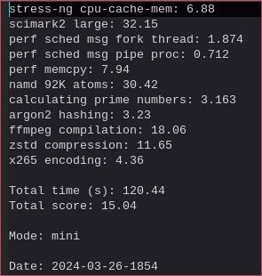
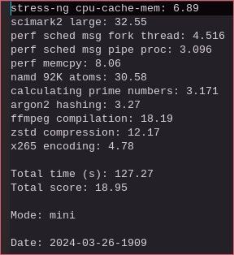
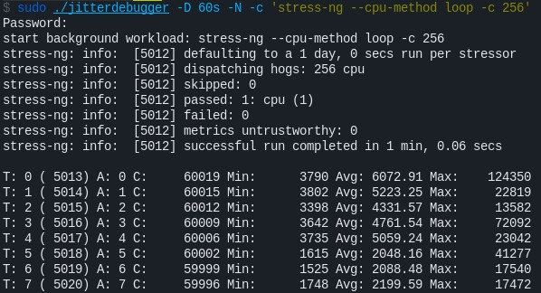
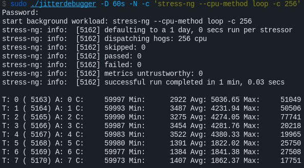
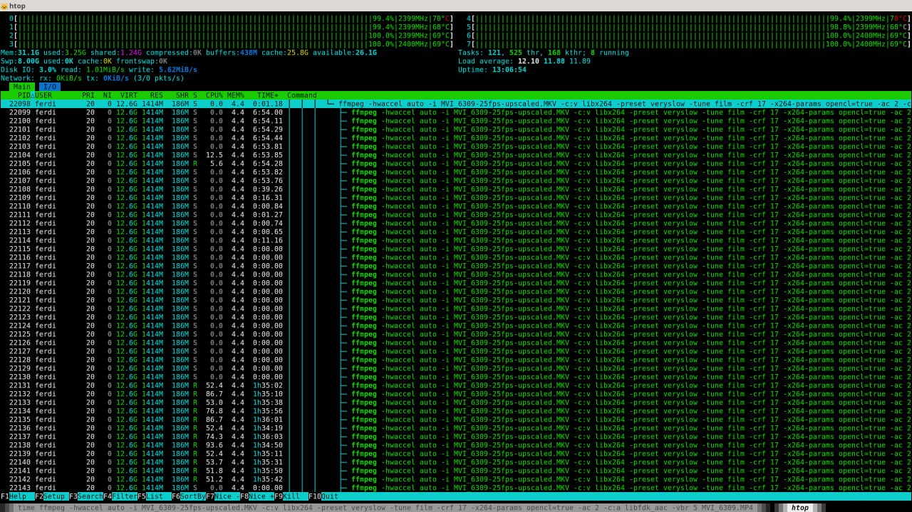
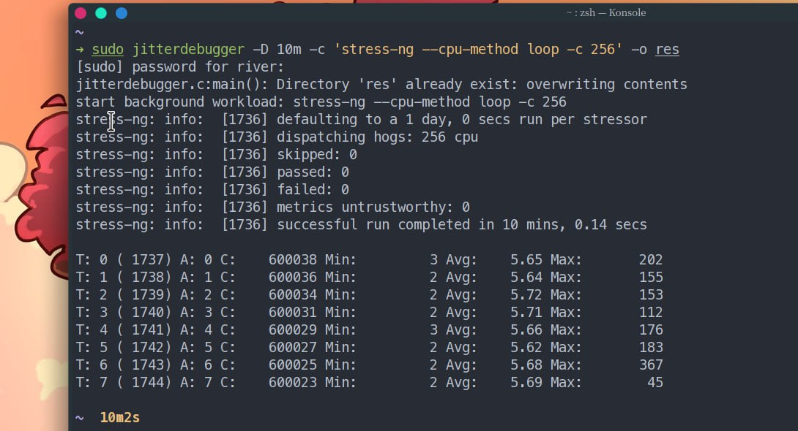
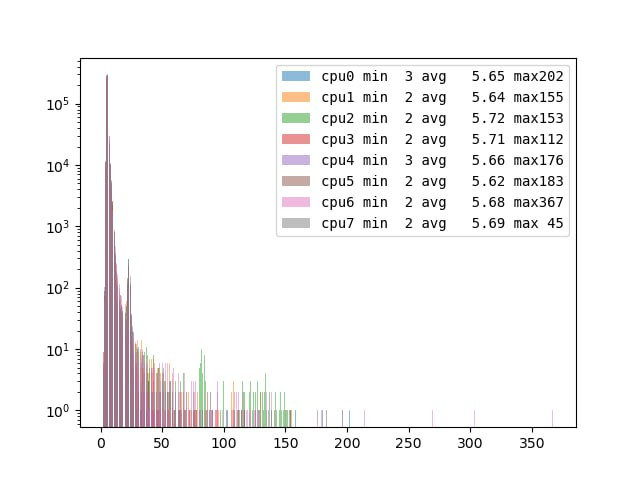
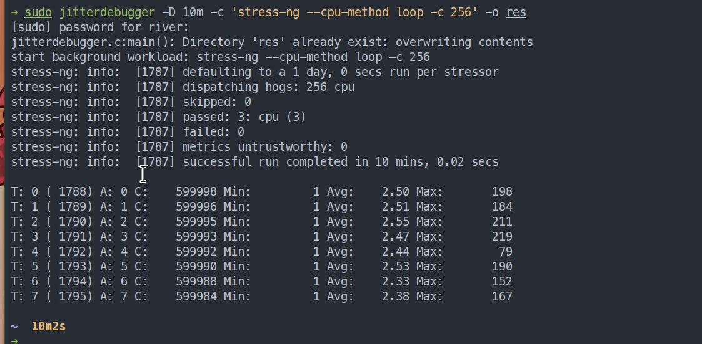
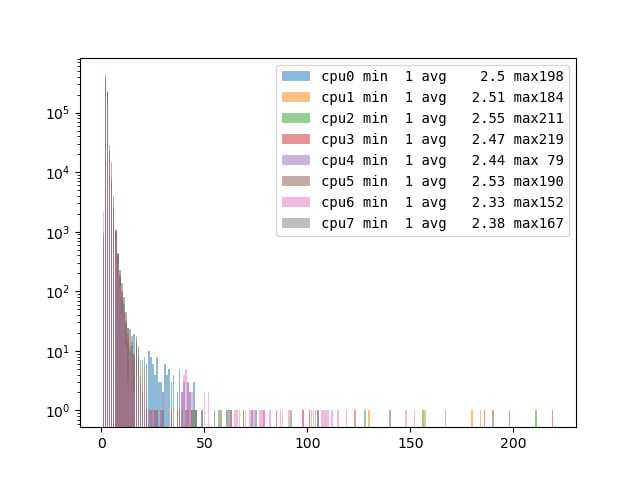

# Linux CPU Schedulers Benchmarks and Feedback

## ECHO CPU Scheduler

### By Array (@A_Array)

[stress-ng](resources/comparision.txt)

### By Peter (@ptr1337)

*BORE*

*ECHO*

### By Skyblueborb (@Skyblueborb)

> its pretty amazing not gonna lie, earlier my browser would start to lag when my pc was stuck at 100% compiling.
> now its pretty responsive, great job

*default*

*echo*

### By @Ferdi Scholten (@Ferdi_Scholten)

> Finally got to test your new echo scheduler. Had to work around a kernel bug with 6.8.2 first (intel bluetooth on my system).
> On my laptop (Lenovo P52s) the raw performance of echo is similar or slightly better than eevdf.
> But when multitasking echo seems to do a better job of keeping things going smoothly.

> For the actual benchmarks I did they were video transcoding and code compilation. These are the results:
>
> **EEVDF**
>
> [out#0/webm @ 0x5629cf176140] video:12301KiB audio:66KiB subtitle:0KiB other streams:0KiB global headers:0KiB muxing overhead: 0.030094%
frame=  180 fps=1.1 q=21.0 Lsize=   12371KiB time=00:00:05.96 bitrate=16988.8kbits/s speed=0.0365x
test5eevdf.webm created in 164 seconds
>
> [out#0/webm @ 0x557bae01fae0] video:13290KiB audio:539KiB subtitle:0KiB other streams:0KiB global headers:0KiB muxing overhead: 0.185755%
> frame= 1524 fps=2.6 q=21.0 Lsize=   13855KiB time=00:00:51.98 bitrate=2183.5kbits/s dup=0 drop=39 speed=0.0884x
> test2eevdf.webm created in 589 seconds
>
> AOM compilation
real  1m46,140s,
 user  3m8,868s,
 sys  0m15,622s
>
> real  1m46,603s,
 user  3m9,063s,
 sys  0m15,676s
>
> FFmpeg compilation
real  3m3,995s,
 user  7m40,606s,
 sys  0m38,110s
>
> **ECHO**
>
> [out#0/webm @ 0x562ee23d5140] video:12301KiB audio:66KiB subtitle:0KiB other streams:0KiB global headers:0KiB muxing overhead: 0.030094%
frame=  180 fps=1.3 q=21.0 Lsize=   12371KiB time=00:00:05.96 bitrate=16988.8kbits/s speed=0.0446x
test5echo.webm created in 134 seconds
>
> [out#0/webm @ 0x563775225ae0] video:13290KiB audio:539KiB subtitle:0KiB other streams:0KiB global headers:0KiB muxing overhead: 0.185755%
frame= 1524 fps=2.6 q=21.0 Lsize=   13855KiB time=00:00:51.98 bitrate=2183.5kbits/s dup=0 drop=39 speed=0.0882x
test2echo.webm created in 589 seconds
>
> AOM compilation
real  1m46,416s,
 user  3m7,630s,
 sys  0m15,674s
>
> real  1m47,497s,
 user  3m7,294s,
 sys  0m15,846s
>
> FFmpeg compilation
real  3m2,495s,
 user  7m36,955s,
 sys  0m37,232s

> By the way while posting this and making the screenshot, a large transcode is happily progressing which would
have caused serious lag when using eevdf but telegram, text editing and browsing, partial screenshotting etc.
all function without noticing the cpu and gpu full utilization in the background.

> This is happening while posting and without me noticing any delay in typing or anything else....

### By Mr. Error (@RiverOnVenus)

[My opinion on Linux CPU scheduler](https://zhui.dev/2022-11/linux-cpu-schedulers)

jitterdebugger to measure wake up latency

*arch vanilla kernel 6.8.1*

*arch vanilla kernel 6.8.1*

*arch vanilla kernel 6.8.1 patched ECHO*

*arch vanilla kernel 6.8.1 patched ECHO*

### By Notyou-Drbiguint (@Drbiguintyohaparfum)

[default vs bore vs echo](resources/tests.txt)

### By Hamad Al Marri

[WebGL - default](resources/hamad-webgl-default.mp4)

[WebGL - echo](resources/hamad-webgl-echo.mp4)

*Note: The default linux scheduler shows more FPS
and while running the test the motion was smooth, however
the OBS recording frame rate has went down in the favour of the web page render.
In the other hand, ECHO was able to fairly distribute the CPU time between all tasks
and the motion was smooth while testing as well as the OBS recording in which the
webGL frame rate was lower than default scheduler but that is normal because all running
tasks had enough CPU time to work togather. In the default scheduler since OBS didn't have
enough CPU time, its frame rate went down which even gives more CPU time to the WebGL. The final findings
is that ECHO is more fair and smoother.*

[phoronix-test-suite](https://openbenchmarking.org/result/2404043-NE-DEFAULTVS48)
